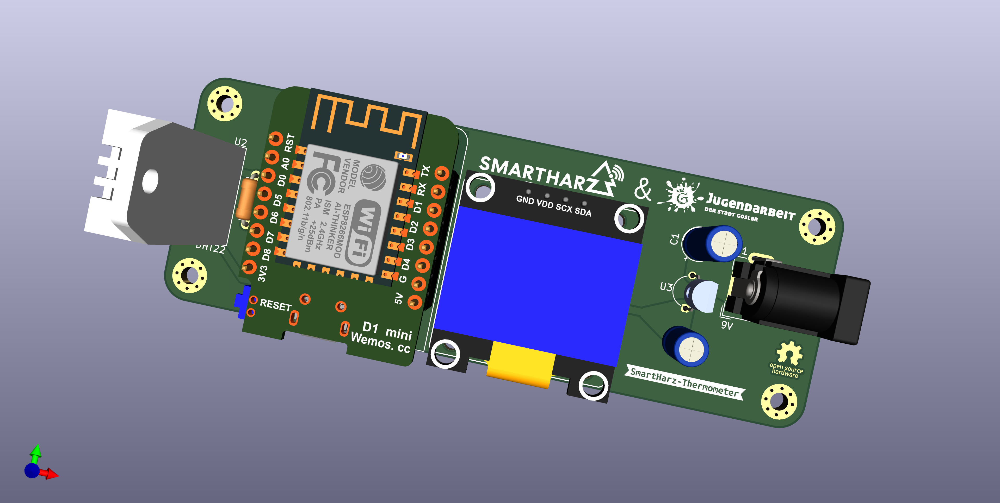

# SmartHarz-Thermometer

## Trägerplatine für DHT22 und D1 Mini mit OLED (Deutsch|[English below](#carrier-board-for-dht22-and-a-d1-mini-with-oled-english))

Entstanden ist die Platine für Elektronik-Workshops mit Kindern und Jugendlichen.
Diese Workshops sollen sowohl  Grundlagen des Lötens als auch der Programmierung vermitteln.
Weiter sollen schnelle Erfolge erzielt werden, die auch einen Mehrwert liefern und nicht nur in der Schublade verschwinden.

Das gesamte Setup funktioniert entweder mit ESP Easy oder kann mit Arduino oder Bare Metal programmiert werden.

Durch die Verwendung des D1 Mini stehen auch WLAN und Bluetooth für die Einbindung in Home Automatisierung oder andere Datenaggregatoren zur Verfügung.
Im Workshop wird das Thermometer auf Basis von MQTT in NodeRed integriert.

Die Stromversorgung kann wahlweise über die USB Schnittstelle oder über Rundstecker mit +6V bis +40V Gleichstrom erfolgen.
Im Bausatz selber befinden sich Adapter für 9V Blöcke und eine entsprechende Batterie.

## Carrier board for DHT22 and a D1 Mini with OLED (English)

The PCB was designed for use in electronics workshops mith kids.
The workshops focus on different aspects of EE like simple soldering and programming and reach success fast.
As well the result should have an actual value and would not disappear in the back of some drawer.

The whole setup can be used with ESP Easy or alternatively programmed through Arduino or bare metal.
By using the D1 Mini, WiFi and Bluetooth are available as well and can be used for integration in Home Automation or other data aggregators.
During the workshop the thermometer is being integrated into NodeRed through MQTT

Power can be either supplied through the USB socket on board of the D1 Mini or through the barrel jack with DC from +6V up to +40V.
The kit includes an adapter for 9V batteries and a battery.
